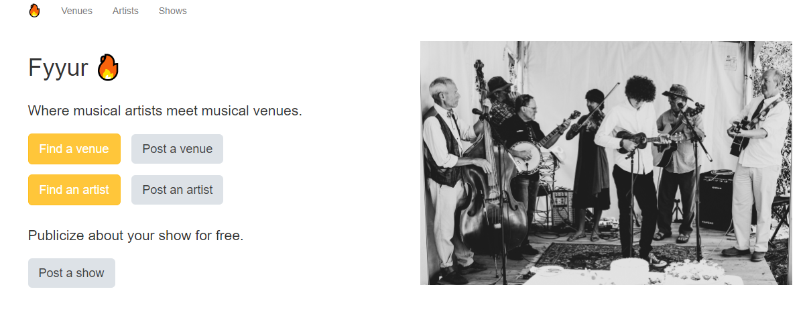

Fyyur
-----

### Introduction

Fyyur is a musical venue and artist booking site that facilitates the discovery and bookings of shows between local performing artists and venues. This site lets you list new artists and venues, discover them, and list shows with artists as a venue owner.



The project is powered up by the API endpoints for the Fyyur site by connecting to a PostgreSQL database for storing, querying, and creating information about artists and venues on Fyyur.

### Tech Stack

Our tech stack includes:

* **SQLAlchemy ORM** to be our ORM library of choice
* **PostgreSQL** as our database of choice
* **Python3** and **Flask** as our server language and server framework
* **Flask-Migrate** for creating and running schema migrations
* **HTML**, **CSS**, and **Javascript** with [Bootstrap 3](https://getbootstrap.com/docs/3.4/customize/) for our website's frontend

### Main Files: Project Structure

  ```sh
  ├── README.md
  ├── app.py *** the main driver of the app. Includes your SQLAlchemy models.
                    "python app.py" to run after installing dependences
  ├── config.py *** Database URLs, CSRF generation, etc
  ├── error.log
  ├── forms.py *** forms
  ├── requirements.txt *** The dependencies we need to install with "pip3 install -r requirements.txt"
  ├── static
  │   ├── css 
  │   ├── font
  │   ├── ico
  │   ├── img
  │   └── js
  └── templates
      ├── errors
      ├── forms
      ├── layouts
      └── pages
  ```

Overall:
* Models are located in the `MODELS` section of `app.py`.
* Controllers are also located in `app.py`.
* The web frontend is located in `templates/`, which builds static assets deployed to the web server at `static/`.
* Web forms for creating data are located in `form.py`


Highlight folders:
* `templates/pages` -- Defines the pages that are rendered to the site. These templates render views based on data passed into the template’s view, in the controllers defined in `app.py`. These pages successfully represent the data to the user, and are already defined for you.
* `templates/layouts` -- Defines the layout that a page can be contained in to define footer and header code for a given page.
* `templates/forms` -- Defines the forms used to create new artists, shows, and venues.
* `app.py` -- Defines routes that match the user’s URL, and controllers which handle data and renders views to the user. This is the main file you will be working on to connect to and manipulate the database and render views with data to the user, based on the URL.
* Models in `app.py` -- Defines the data models that set up the database tables.
* `config.py` -- Stores configuration variables and instructions, separate from the main application code. This is where you will need to connect to the database.

Functionality Implemented.
-----

1. The web app successfully connects to a PostgreSQL database. 
2. UI functionality:
  * when a user submits a new artist record, the user is able to see it populate in /artists, as well as search for the artist by name and have the search return results.
  * the user is able to go to the URL `/artist/<artist-id>` to visit a particular artist’s page using a unique ID per artist, and see real data about that particular artist.
  * Venues are displayed in groups by city and state.
  * Search is allowed to be partial string matching and case-insensitive.
  * Past shows versus Upcoming shows are distinguished in Venue and Artist pages.
  * A user is able to click on the venue for an upcoming show in the Artist's page, and on that Venue's page, see the same show in the Venue Page's upcoming shows section.


### Development Setup

First, [install Flask](http://flask.pocoo.org/docs/1.0/installation/#install-flask) if you haven't already.

  ```
  $ cd ~
  $ sudo pip3 install Flask
  ```

To start and run the local development server,

1. Initialize and activate a virtualenv:
  ```
  $ cd YOUR_PROJECT_DIRECTORY_PATH/
  $ virtualenv --no-site-packages env
  $ source env/bin/activate
  ```

2. Install the dependencies:
  ```
  $ pip install -r requirements.txt
  ```

3. Run the development server:
  ```
  $ export FLASK_APP=myapp
  $ export FLASK_ENV=development # enables debug mode
  $ python3 app.py
  ```

4. Navigate to Home page [http://localhost:5000](http://localhost:5000)
